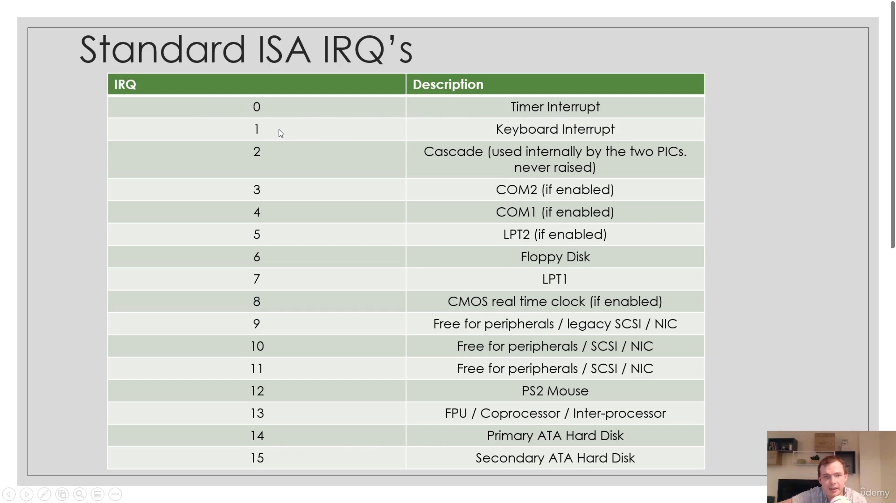
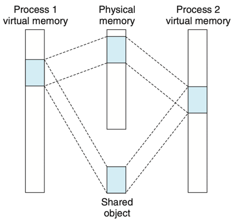
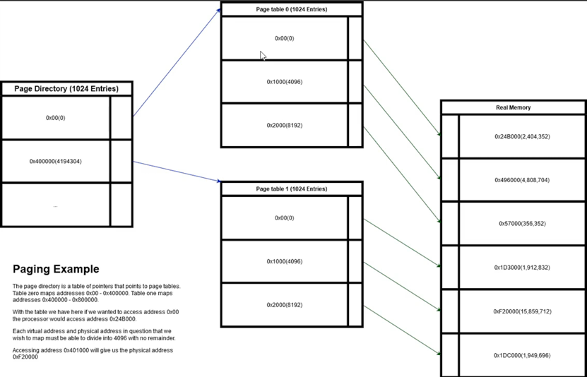
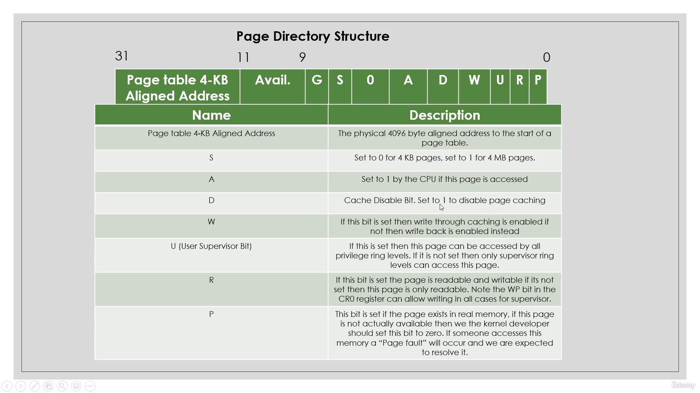
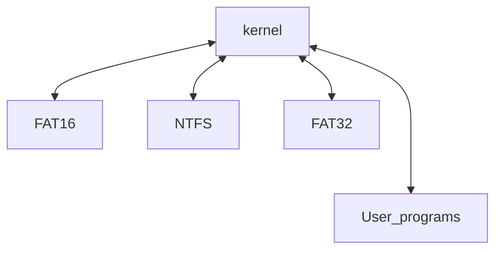

# Protected Mode
## How to enter the protected mode
Three steps here:
1. Disable interrupts, including [NMI](https://wiki.osdev.org/Non_Maskable_Interrupt) (as suggested by Intel Developers Manual).
2. Enable the [A20 Line](https://wiki.osdev.org/A20_Line).
3. Load the [Global Descriptor Table](https://wiki.osdev.org/Global_Descriptor_Table) with segment descriptors suitable for code, data, and stack.

### Non Maskable Interrupt
> Definition in wiki:
> 
> The Non-Maskable Interrupt (NMI) is a hardware-driven interrupt much like the PIC interrupts, 
> but the NMI goes either directly to the CPU, or via another controller (e.g., the ISP)---in which case it can be masked.


### [A20 Line](https://wiki.osdev.org/A20_Line)
> Definition in wiki:
> 
> The A20 Address Line is the physical representation of the 21st bit (number 20, counting from 0) of any memory access. 
> When the IBM-AT (Intel 286) was introduced, it was able to access up to sixteen megabytes of memory (instead of the 1 MByte of the 8086). 
> But to remain compatible with the 8086, a quirk in the 8086 architecture (memory wraparound) had to be duplicated in the AT. 
> To achieve this, the A20 line on the address bus was disabled by default.
> The wraparound was caused by the fact the 8086 could only access 1 megabyte of memory, 
> but because of the segmented memory model it could effectively address up to 1 megabyte and 64 kilobytes (minus 16 bytes). 
> Because there are 20 address lines on the 8086 (A0 through A19), any address above the 1 megabyte mark wraps around to zero. 
> For some reason a few short-sighted programmers decided to write programs that actually used this wraparound 
> (rather than directly addressing the memory at its normal location at the bottom of memory). 
> Therefore in order to support these 8086-era programs on the new processors, 
> this wraparound had to be emulated on the IBM AT and its compatibles; 
> this was originally achieved by way of a latch that by default set the A20 line to zero. 
> Later the 486 added the logic into the processor and introduced the A20M pin to control it.
> For an operating system developer (or Bootloader developer) this means the A20 line has to be enabled so that all memory can be accessed. 
> This started off as a simple hack but as simpler methods were added to do it, 
> it became harder to program code that would definitely enable it and even harder to program code 
> that would definitely disable it.

How to enable A20 line:
1. keyboard controller
2. Fast A20 gate
3. Access of 0xee

### Global Descriptor Table
Definition in wiki:
The Global Descriptor Table (GDT) is a binary data structure specific to the IA-32 and x86-64 architectures. 
It contains entries telling the CPU about memory segments. 

-----------------------------------

## Interrupt descriptor table
Source: [osdev Interrupt descriptor table](https://wiki.osdev.org/Interrupt_Descriptor_Table)
- Describe how interrupts are invoked in protected mode
- Can be mapped anywhere in memory
- Different from the interrupt vector table

Interrupt descriptor

| Name     | Bit   | Known as                   | Description                                                             |
|----------|-------|----------------------------|-------------------------------------------------------------------------|
| Offset   | 46-63 | offset 16-31               | The higher part of the offset to execute                                |
| P        | 47    | Present                    | This should be set to zero for unused interrupts                        |
| DPL      | 45-46 | Descriptor Privilege Level | The ring level the processor requires to call this interrupt            |
| S        | 44    | Storage Segment            | Should be set to zero for trap gates                                    |
| Type     | 40-43 | Gate type                  | The type of gate this interrupt is treated as                           |
| O        | 32-49 | Unused 0-7                 | Unused bits in this structure                                           |
| Selector | 16-31 | Selector 0-15              | The selector this interrupt is bounded to i.e. the kernel code selector |
| Offset   | 0-15  | Offset 0-15                | The lower part of the offset to execute                                 |

```c
struct idt_desc{
    u16 offset_1; /* offset bit 0 - 15 */
    u16 selector; /* a code segment selector in GDT or LDT */
    u8 zero;      /* unused, set to 0 */
    u8 type_attr; /* type and attributes, see below */
    u16 offset_2; /* offset bits 16 - 31*/
}__attribute__((packed));
```

Interrupt Gate Types

| Name                        | value       | Description                                                                                                                                                |
|-----------------------------|-------------|------------------------------------------------------------------------------------------------------------------------------------------------------------|
| 80386 32 bit task gate      | 0x05/0b0101 | Tasks gates reference TSS descriptors and cons can assist in multitasking when exceptions occur                                                            |
| 80386 16 bit interrupt gate | 0x06/0b0110 | Interrupts gates are to be used for interrupts that we want ot invoke ourselves in our code                                                                |
| 80386 16 bit trap gate      | 0x07/0b0111 | Trap gates are like interrupt gates however they are used for exceptions. They also disable interrupts on entry and reenable them on an `iret` instruction |
| 80386 32 bit interrupt gate | 0x0E/0b1110 | Interrupts gates are to be used for interrupts that we want ot invoke ourselves in our code                                                                |
| 80386 32 bit trap gate      | 0x0F/0b1111 | Trap gates are like interrupt gates however they are used for exceptions. They also disable interrupts on entry and reenable them on an `iret` instruction |

Interrupt descriptors are stored in an array with index 0 defining interrupt zero `intr. 0` ..., index 1 
```c
struct idt_desc idt_desc[...];
```

IDTR

| Name  | Bit   | Description                                            |
|-------|-------|--------------------------------------------------------|
| Limit | 0-15  | The length of the interrupt descriptor table minus one |
| Base  | 16-47 | The address of the interrupt descriptor                |

```c
struct idtr_desc
{
    u16 limit;
    u32 base;
}__attribute__((packed));
```

Note
- Interrupt descriptor table can be defined where we like in memory
- Interrupt descriptor table are set up differently than the interrupt vector table
- During an interrupt certain property can be pushed to the stack. 
  The rules involved with this are quite complicate, so we will discuss them as they come and they do not always apply
- IDT is usually used in protected mode and IVT is used in real mode

### Programmable Interrupt Controller (PIC)
- Allows hardware to interrupt the processor state
  - The programmable interrupt controller allows different types of hardware to interrupt 
    the processor such as the hard disk, keyboard and more...
- Programmable
- Requires interrupt acknowledge

Standard IRQ:

| IRQ | Description                               |
|-----|-------------------------------------------|
| 0   | Timer Interrupt                           |
| 1   | Keyboard Interrupt                        |
| 2   | Cascade (used internally by the two PICs) |
| 3   | COM2                                      |
| 4   | COM1                                      |
| 5   | LPT2                                      |
| 6   | Floppy Disk                               |
| 7   | LPT1                                      |
| ... | ...                                       |



Reference: [PIC introduction](https://stenlyho.blogspot.com/2008/08/pic.html)

- IRQ are mapped to a starting interrupt for example lets choose 0x20
- IRQ 0 would then be interrupt 0x20
- IRQ 1 would then be interrupt 0x21
- IRQ 2 would then be interrupt 0x22

> By default, some of the IRQ are mapped to interrupts 8-15 this is a problem as these
> interrupts are reserved in protected mode for exception so we are required to remap the PIC

#### Master and slave
- There are two PIC in the system, one is the master and the other is slave
- Master control IRQ 0-7 while slave control IRQ 8-15.
- 0x20, 0x21 -> master IRQ; 0xa0, 0xa1 -> slave IRQ

-----------------------------------

## heap
- Heap is a giant memory region that can be shared in a controlled manner
- You can ask the heap for memory and tell the heap when you're done with memory
- Heap implementations are essentially system memory managers
### Introduction
- In C programming language, you can point to any memory address in RAM regardless if you can access it or not
  ```c
  char *ptr = (char *)0x1000;
  ptr[0] = 'a';
  ```
  if you run this code in user space, it will be crashed, because of the protection issue
  however, if you run it in kernel space, it will not crash
- Memory limits for a 32-bit kernel
  - In protected mode, we have certain restrictions, the processor is in a 32 bit state
  - As we are running in a 32 bit mode, we have access only to 32 bit memory addresses 
    allowing us to address 4 GB RAM regardless how much RAM is installed
  - An array of uninitialized memory is available to us from address "0x1000000"
    (Can be a lot of RAM or very little depending on the installed memory)
  - Note: 0xC0000000 is reserved this means the memory array we have at address 
    0x1000000 can give us a maximum of 3.22GB machine with 4 GB or higher memory is installed
- The heap
  - Can be pointed at an address unused by hardware that is also big enough for us to use
  - The heap data size can be defined, e.g. 100MB, 1000MB etc.
  - So long as we have 100 MB of memory available our heap will work fine
  - We need a heap implementation to make our heap work properly
  - The heap will be responsible for storing information in our kernel
  - The heap implementation will be responsible for managing this giant chunk of memory tha we call the heap

### Simplest heap implementation
- Start with a start address and call it a `current address` point it somewhere free i.e. 0x10000000
- Any call to malloc gets the current address stores it in a temporary variable called `tmp`
- Now the current address is incremented by the size provided to `malloc`
- Temporary variable called "tmp" that contains the allocated address is returned
- `Current address` now contains the next address for `malloc` to return `malloc` is called again
Benefit: easy to implement
Negative: Memory never be released
Code:
```c
void *current_address = (void *)0x10000000;
void *malloc(int size)
{
    void *tmp = current_address;
    current_address += size;
    return tmp;
}
void free(void *ptr)
{
    // do nothing
}
```

### Our heap implementation
- Will consist of a giant table which describes a giant of free memory in the system.  
  This table will describe which memory is taken, which memory is free and so on. We will call it "entry table"
- Will have another pointer to a giant piece of the memory, this will be the actual heap data its itself 
  that users can use `malloc`. We will cal this "data pool". If our heap can allocate 100 MB of RAM 
  then the heap data pool will be 100 MB in size
- Our heap implementation will be block based, each address returned from `malloc` will be aligned to 4096 and  
  will at least be 4096 in size
- If you request to have 50 bytes, there are 4096 bytes for you

### Entry table
- Composes of an array of 1 byte values that represent an entry in our heap data pool
- Array size is calculated by taking the heap data pool size and dividing it by our block size of 4096 bytes.
  we are left with the total number of entries we need in our array

> we want a 100MB heap then the math is 100MB/4096 = 25600 bytes in our entry table
> if our heap data pool is at address `0x1000000` then entry zero in our table will represent address `0x1000000`
> Entry one will represent address `0x1001000`, and entry two will represent `0x1002000`

#### Entry structure
| HAS_N | IS_FIRST | 0   | 0   | ET_3   | ET_2   | ET_1   | ET_0 |
|-------|----------|-----|-----|--------|--------|--------|------|

Where
- HAS_N: set if the entry to the right of us is part of our allocation
- IS_FIRST: set if there is the first entry of our allocation
> Each entry byte describes 4096 bytes of data in the heap data pool

Entry types:
- HEAP_BLOCK_TABLE_ENTRY_TAKEN : The entry is taken and the address cannot be used
- HEAP_BLOCK_TABLE_ENTRY_FREE  : The entry is free and may be used

Data pool:
- Simply a raw flat array of thousands or millions of bytes that our heap implementation can give to people who need memory

A example
- Firstly we assume our base address is `0x1000000`
- We assume our heap is 100 MB, that is 25600 entries

### Free
- Calculate the block number based on the address provided to us to free
- Go through the entry table starting at the block number we have calculated, set each entry to "0x00" until 
  we reach the last block of the allocation
- We know how many blocks we need to free because the current block we are freeing will not have the "HAS_N" bit set in the entry byte

### pros and cons
pros
- Fast to allocate blocks of memory
- Fast to free blocks of memory
- Can be written in under 200 lines of code
cons
- Memory fragmentation
- wasted space
-----------------------------------
## Paging
### Introduction
- Paging allows us to remap memory address to point to other memory addresses
- Can be used to provide the illusion we have the maximum amount of RAM installed
- Can be used to hide memory from other processes

### Remapping memory
- Paging allows us to remap one memory to another, so 0x100000 could point to 0x200000
- Paging works in 4096 byte block sizes by default. The blocks are called pages
- When paging is enabled the MMU (Memory Management Unit) will look at your paged table to resolve virtual addresses
- Paging allows us to pretend memory exist when does not

### virtual address vs physical address
- Virtual address are addresses that are not pointing to the address in memory that their value says they are
  E.g. virtual memory address 0x100000 might point to physical address 0x200000 as an example
- Physical addresses are absolute addresses in memory whose value points to the same address in memory. 
  E.g. physical memory address 0x100000 is actual address
- virtual address and physical address is the method to access the memory



Structure overview:



- 1024 pages directories point to 1024 pages tables
- 1024 pages table entries per page table
- each page table entry covers 4096 bytes of memory
- each "4096" byte block of memory is called a page
- 1024 * 1024 * 4096 = 4GB of addressable memory
- Thus, the page directory structure
  - Holds a pointer to a page table
  - Holds attributes

### Page directory structure



Page fault exception:
- The cpu will call the page fault interrupt 0x14 when there was a problem with paging
- Exception:
  - Access a page in memory that does not have its `P(present)` bit set
  - Invoked if you access a page that is for supervisor, but you are not supervisor
  - Invoked if you write a page that is read only, and you are not supervisor

Hiding memory from processor
- If we give each process, its own page directory table then we can map the memory for the processor
  however we want it to be. We can make it so the processor can only see itself
- Hiding memory can be achieved by switching the page directories when moving between processes
- All processes can access the same virtual addresses, but they will point to different physical addresses

Illusion of memory
- We can pretend we have amount of memory even if we do not
- This is achieved by creating page tables that are not present. Once a process accesses this non-present address a
  page fault will occur. We can then load the page back into memory and the process had no idea
- 100 MB system can act as if it has access to the full 4 GB on a 32 bit architecture

Benefit of paging
- Each process can access the same virtual memory addresses, never writing over each other
- Security is an added benefit as we can map out physical memory that we don't want processes to see
- Can be used to prevent overwriting of sensitive data such as program code
- Many more benefits exist

When implementing the function, we need to see [3] to know the control register

## Read from the hard disk
### What is PCI IDE controller
- IDE refers to the electrical specification of cables which connect ATA drives to another device
- IDE allows up to 4 drives to be connected
  - ATA (Serial): Used for modern hard drives
  - ATA (Parallel): Used for hard drives
  - ATAPI (Serial): Used for modern optical drives
  - ATAPI (Parallel): Commonly used for optical drives
- Kernel programmer do not have to care if the drive is serial or parallel

There are some possible drive types
- Primary master drive
- Primary slave drive
- Secondary master drive
- Secondary slave drive

-------------------------
## File system
- A file system is a structure that describes how information is laid on a disk
- Disks are not aware of files
- The operating system knows the file system structure so knows how to read from the disk
- Check the [ATA in osdev]()

Disks
- Hard disks can be thought of as just a giant array of information split into sectors
- Each sector can be read into memory and is given a LBA (Logical Block Address) number
- Files do not exist on the disk
- Disks have no concept of files, for disk, that is only a binary data

Filesystem structure
- Contains raw data for files (remember the disk isn't aware of this)
- Contains the filesystem structure header which can explain things such as how many files are on the disk
  where the root directory is located etc.
- The way files are laid out on disk is different depending on the filesystem you are using for example
  "FAT16", "FAT32", "NTFS" and more ...
- Without filesystem, we would be forced to read and write data through the use of sector numbers structure would not
  exist and corruption would be possible

FAT16 (File Allocation Table) 16 bits
- The first sector in this filesystem format is the boot sector on the disk. Fields also exist in this first sector that
  describe the filesystem such as how many reserved sectors follow this sector
- Then follows the reserved sectors there are sectors ignored by the filesystem. There is a field in the boot sector that
  specified how many reserved sectors there are. (Remember the operating system must ignore these, it's not automatic!
  The disk has no idea)
- Now we have our first file allocation table, this table contains values that represent which clusters on the disk are 
  taken and which are free (A cluster is just a certain number of sectors joined together to represent one cluster)
- Next comes our second file allocation table it's optional though and depends on the FAT16 header in the boot sector
- Now comes our root directory, this explains what files/directories are in the root directory of the filesystem, Each entry
  has a relative name that represent the file or directory name, attribute such as read only, the address of the first 
  cluster representing the data on the disk.
- Finally, we have our data region, all the data is here

What to take away from this
- Disk doesn't understand files they are just giant flat array of bytes
- Operating system need filesystem drivers so they can read from the disk
- Every filesystem is different
- Without implementing a filesystem in your operating system, you cannot have files

-------------------------
## File Allocation Table
- The file allocation table (FAT) is a filesystem developed by microsoft
- IT consists of a series of clusters that hold data and a table that determined data and a table that determines
  the state of a cluster
- The boot sector stores information about the filesystem
### FAT16 filesystem
- Use clusters to represent data and subdirectories
- Each cluster uses a fixed amount of sectors which is specified in the boot sector
- Every file in FAT16 needs to use at least one cluster for its data this means a lot of storage is wasted for small file
- FAT16 cannot store files larger thn 2GB  without file support. With large file support is the maximum

FAT16 disk layout:

| Name           | Size                                                              |
|----------------|-------------------------------------------------------------------|
| Boot sector    | 512 bytes                                                         |
| Reserved       | first_header.reserved_sectors * 512                               |
| FAT1           | first_header.sector_per_fat * 512                                 |
| FAT2 (opt)     | first_header.sector_per_fat * 512 (not discussed)                 |
| Root directory | first_header.root_dir_entries * sizeof(struct fat_directory_item) |
| Data cluster   | -                                                                 |

FAT16 file allocation table explained
- Each entry in the table is 2 bytes long and represents a cluster in the data clusters region that is available or taken
- Clusters can chain together, for example a file larger than one cluster will use two clusters. The value that represents
  the first cluster in the file allocation table will contain the value of next cluster. The final cluster will contain a value of
  0xffff signifying that there are no more cluster
- The size of a cluster is represented in the boot sector

FAT16 Root directory
- filesystem have directories/folders. FAT16 is no different
- FAT16 has what's known as a root directory, this is the top most directory in the system
- Directories contain directory entries of a fixed size

```c
struct fat_directory_item
{
    u8  filename[8];
    u8  ext[3];
    u8  attribute;
    u8  reserved;
    u8  creation_time_tenthes_of_a_sec;
    u16 creation_time;
    u16 creation_data;
    u16 last_access;
    u16 high_16_bits_first_cluster;
    u16 last_mod_time;
    u16 last_mod_data;
    u16 low_16_bits_first_cluster;
    u32 filesize;
} __attribute__ ((packed));
```

- Attribute field contains flags that determine item is a file, or a directory. If it's read only etc.
- If the directory item represents a file, then the first cluster points to the start of the file data.
  if it's representing a directory, then its first cluster will point to a cluster that has directory entry.

Iterating through directories
- In the boot sector contains the maximum number of a root directory entries, we should not exceed this
  value when iterating through the root directory
- We know when we have finished iterating through the root directory or a subdirectory because the first byte of 
  the filename will be equal to zero
- Attribute flags
  - `0x01` Read only
  - `0x02` File hidden
  - `0x04` System file do not move the clusters
  - `0x08` Volume label
  - `0x10` This is not a regular file, it is a directory (if this bit is not set, then this directory represents a regular file)
  - `0x20` archived
  - `0x40` device
  - `0x80` reserved
- The filename is 8 bytes wide and unused bytes are padded with spaces (0x20)
- The extension is 3 bytes wide and unused bytes are padded with spaces (0x20)

Clusters
- Each cluster represents a certain amount of sector linearly to each other
- The amount of sectors that represents a cluster is stored in the boot sector
- The data clusters section in the filesystem contains all the cluster that make up the subdirectories and
  file data of files throughout the FAT filesystem

Useful tips
- Use `__attribute__((packed))` with all structures that are to be stored or read from disk. The C compiler
  can do clever optimization on the structure and this is not we want when working with raw data from the disk
  Thus, setting the attribute to ensure that never happen

## Virtual filesystem layer
- The virtual filesystem layer allows a kernel to support an infinite amount of filesystems
- The virtual filesystem layer allows us to abstract out low level filesystem code
- Allows filesystem functionality to be loaded or unloaded to the kernel at any time

Unlimited Filesystems
- Filesystem drivers can be loaded or unloaded on demand
- The programming interface to the filesystems remains the same for all filesystems

What happens when a disk gets inserted?
- We poll each filesystem and ask if the disk holds a filesystem it can manage
- We call this resolve filesystem
- When a filesystem that can be used with the desk is found then the disk bind its self to its implementation




-------------------------
## Reference:
1. [Intel Protected Architecture](https://www.csie.ntu.edu.tw/~wcchen/asm98/asm/proj/b85506061/cover.html)
2. [osdev paging](https://wiki.osdev.org/Paging)
3. [control register in x86](https://en.wikipedia.org/wiki/Control_register)
4. [aos](https://ceunican.github.io/aos/)